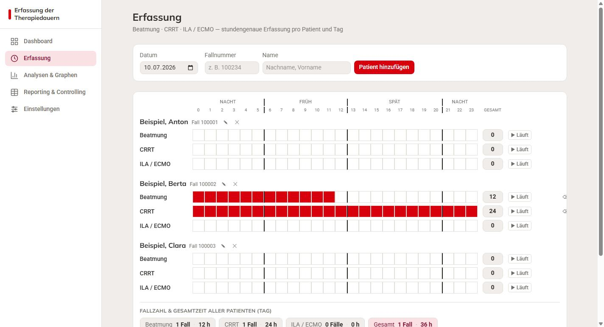
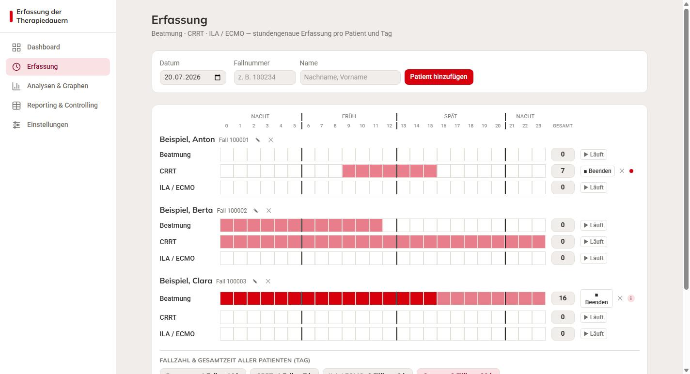
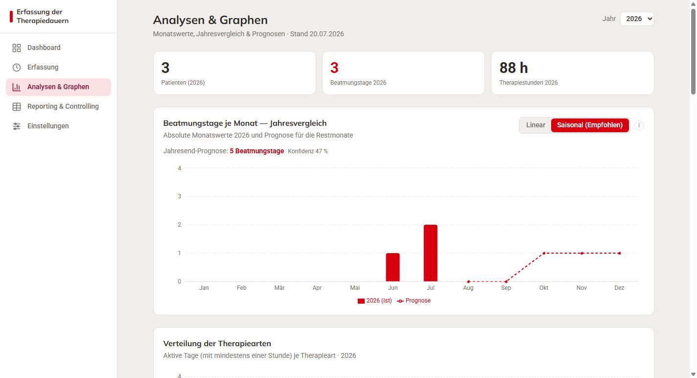
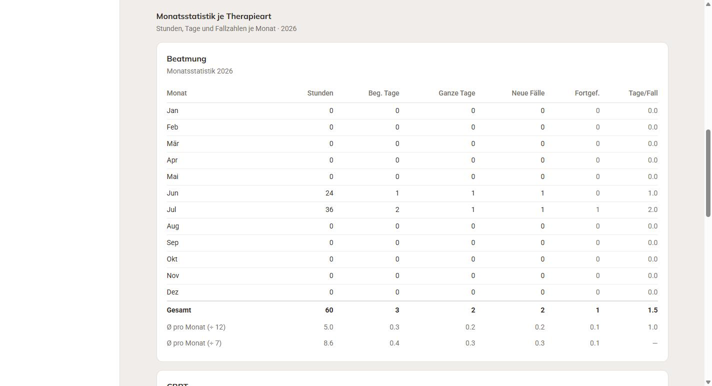
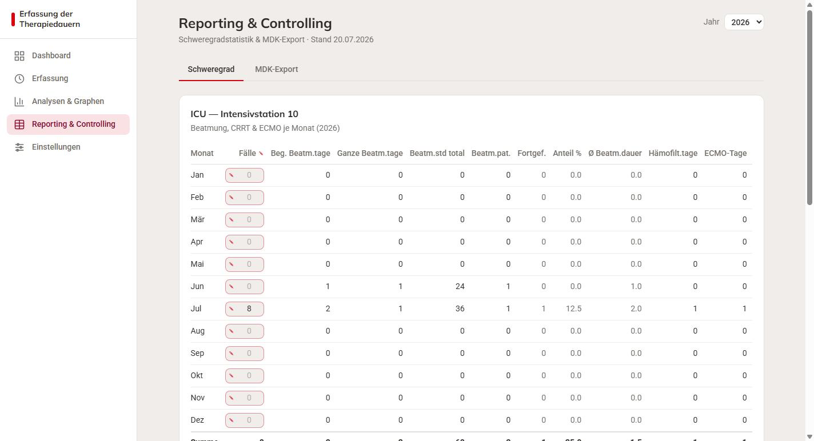
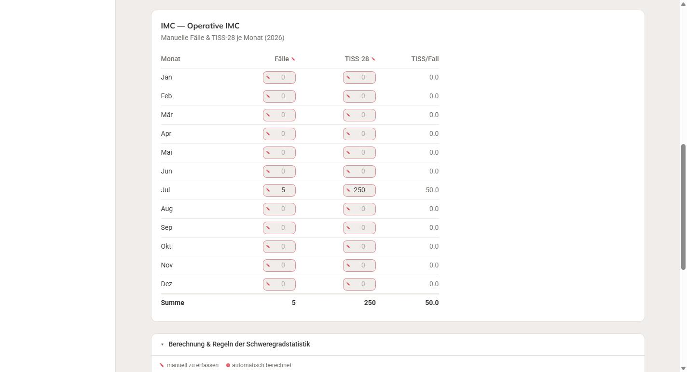
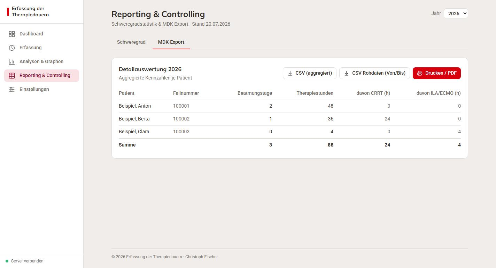

# Erfassung der Therapiedauern — Verarbeitung jedes Feldes

**Zweck dieses Dokuments:** Für jedes Feld der Anwendung ist eineindeutig
dokumentiert, **woher der Wert kommt** (manuell erfasst oder automatisch
berechnet) und **wie er verarbeitet wird** (Formel in Worten). Jede berechnete
Zahl ist an einem durchgehenden Beispiel-Szenario nachvollziehbar — die
Screenshots stammen genau aus diesem Szenario.

Legende: 🖉 = **manuell** erfasst · ⚙ = **automatisch** berechnet.

---

## 1. Grundprinzip der Datenerfassung

Die kleinste Einheit ist die **Stunde**. Für jeden **Patienten**, jeden
**Kalendertag** und jede **Therapieart** (Beatmung, CRRT/Nierenersatz,
ILA/ECMO) gibt es ein 24-Stunden-Raster (Stunde 0 bis 23). Jede Stunde ist
entweder markiert (Therapie lief) oder nicht.

- Ein Datensatz = **ein Patient × ein Tag × eine Therapieart** mit seinen 24
  Stunden.
- Alle höheren Kennzahlen (Tage, Fälle, Statistiken) werden **ausschließlich**
  aus diesen markierten Stunden abgeleitet. Es gibt keine parallel gepflegten
  Zahlen, die auseinanderlaufen könnten — außer den ausdrücklich als *manuell*
  gekennzeichneten Feldern (Fallzahlen und TISS-28-Punkte der
  Schweregradstatistik).

---

## 2. Das Beispiel-Szenario (Grundlage aller Screenshots)

Berichtsjahr **2026**, drei Patienten:

| Patient | Fallnummer |
|---|---|
| Beispiel, Anton | 100001 |
| Beispiel, Berta | 100002 |
| Beispiel, Clara | 100003 |

Erfasste Therapien:

| Patient | Tag | Therapie | markierte Stunden | = Stunden |
|---|---|---|---|---|
| Anton | 28.06.2026 | Beatmung | 0–23 | 24 |
| Anton | 03.07.2026 | Beatmung | 0–23 | 24 |
| Berta | 10.07.2026 | Beatmung | 0–11 | 12 |
| Berta | 10.07.2026 | CRRT | 0–23 | 24 |
| Clara | 15.07.2026 | ILA/ECMO | 20–23 | 4 |

Manuelle Schweregrad-Eingaben (Juli 2026): ICU **Fälle 8 / TISS-28 400**,
IMC **Fälle 5 / TISS-28 250**.

> Anton wurde sowohl im Juni als auch im Juli beatmet — er dient dem Nachweis
> der Regel „neue vs. fortgeführte Fälle" (Abschnitt 9).

---

## 3. Erfassung (Stundenraster)



| Feld | Herkunft | Verarbeitung | Beispiel (10.07.) |
|---|---|---|---|
| Datum | 🖉 | Wählt den anzuzeigenden Kalendertag. | 10.07.2026 |
| Fallnummer | 🖉 | Fachlicher Schlüssel; **eindeutig** — dieselbe Nummer kann nicht zweimal vergeben werden (Vergleich getrimmt, Groß/Kleinschreibung egal). | 100002 |
| Name | 🖉 | Anzeigename des Patienten. | Beispiel, Berta |
| Stundenzelle (0–23) | 🖉 | Klick/Wischen markiert bzw. löscht die Stunde. Rot = Therapie lief. | Berta Beatmung 0–11 |
| **Gesamt** (je Zeile) | ⚙ | Anzahl markierter Stunden dieser Zeile. | Beatmung **12**, CRRT **24** |
| Tages-Summe „N Fälle" (je Art) | ⚙ | Anzahl **verschiedener Patienten** mit ≥1 Stunde dieser Art an dem Tag. | Beatmung **1 Fall** |
| Tages-Summe „M h" (je Art) | ⚙ | Summe aller markierten Stunden dieser Art über alle Patienten des Tages. | CRRT **24 h** |
| Tages-Summe „Gesamt" | ⚙ | Distinkte Patienten des Tages · Summe aller Stunden aller Arten. | **1 Fall · 36 h** (12+24) |

---

## 4. Laufende Therapien („Läuft" / „Beenden" / „Verwerfen")



Eine Therapie muss nicht Stunde für Stunde geklickt werden. Mit **▶ Läuft** wird
der **Start** gemerkt; die Stunden füllen sich danach automatisch bis zur
aktuellen Uhrzeit — auch über Mitternacht und nach einem Neustart des Rechners
oder Servers. Es wird dabei **nur der Start gespeichert**; „Zeit vergeht" erzeugt
keinen Schreibvorgang und kann daher auch bei Ausfällen keine Lücke hinterlassen.

| Feld / Aktion | Herkunft | Verarbeitung |
|---|---|---|
| **▶ Läuft** | 🖉 | Merkt den Start (aktuelle Stunde). Die Zeile füllt sich fortlaufend bis „jetzt". |
| **■ Beenden** | 🖉 | Schreibt die bis dahin gelaufenen Stunden fest in die Historie und beendet den Lauf. Ein verpasstes Ende korrigiert man anschließend durch Entmarkieren zu viel erfasster Stunden. |
| **✕ Verwerfen** | 🖉 | Entfernt eine laufende Therapie **ohne** Stunden zu speichern — für einen versehentlichen „Läuft"-Klick. |
| Lauf-Anzeige (Puls / ⓘ) | ⚙ | Dauer-Warnung: unter 14 Tagen ein ruhiger Punkt; **ab 14 Tagen** ⓘ „Langzeitbeatmung"; **ab 28 Tagen** ⓘ (rot) „Ende vergessen?". Schwellen an der klinischen Definition orientiert. Maus-Over nennt die Tage. |

*Im Screenshot:* Anton CRRT läuft seit heute 9 Uhr (Puls, Gesamt 7); Clara
Beatmung läuft seit 20 Tagen (ⓘ „Langzeitbeatmung ≥ 14 Tage").

---

## 5. Analysen & Graphen — Kennzahlen und Prognose



| Feld | Herkunft | Verarbeitung | Beispiel 2026 |
|---|---|---|---|
| Patienten (Jahr) | ⚙ | Anzahl Patienten mit ≥1 Record im Jahr. | **3** |
| Beatmungstage (Jahr) | ⚙ | Summe aller (Patient, Tag) mit ≥1 Beatmungsstunde. | **3** (Anton 28.06. + 03.07., Berta 10.07.) |
| Therapiestunden (Jahr) | ⚙ | Summe aller markierten Stunden aller Arten. | **88 h** (24+24+12+24+4) |
| Jahresend-Prognose | ⚙ | Hochrechnung der Beatmungstage aufs Jahresende (saisonal gewichtet). Erfolgt **erst ab 3 Monaten** Datenbasis — vorher wird nichts hochgerechnet, sondern nur der Ist-Stand gezeigt. | **5 Beatmungstage** |
| Konfidenz | ⚙ | Verlässlichkeitshinweis (kein statistisches Konfidenzintervall): steigt mit der Zahl vorliegender Monate, gedeckelt bei 0,8, mal Modellfaktor. Im Juli: min(7/12; 0,8) × 0,8 = **47 %**. | 47 % |
| Balken je Monat | ⚙ | Nicht-kumulierte Beatmungstage des Monats. | Jun **1**, Jul **2** |
| Verteilung der Therapiearten | ⚙ | Aktive Tage (mit ≥1 Stunde) je Therapieart im Jahr. | Beatmung 3, CRRT 1, ILA/ECMO 1 |

### Monatsstatistik je Therapieart



Beispiel **Beatmung** (Juni + Juli):

| Feld | Herkunft | Verarbeitung | Juni | Juli |
|---|---|---|---|---|
| Stunden | ⚙ | Summe markierter Stunden des Monats. | 24 | 36 |
| Beg. Tage | ⚙ | Tage mit ≥1 Stunde. | 1 | 2 |
| Ganze Tage | ⚙ | Stunden ÷ 24, abgerundet. | 1 | 1 |
| Neue Fälle | ⚙ | Im Monat **neu** begonnene Fälle (siehe Abschnitt 9). | 1 | 1 (Berta) |
| Fortgef. | ⚙ | Fälle, die schon im **Vormonat** liefen. | 0 | 1 (Anton) |
| Tage/Fall | ⚙ | Beg. Tage ÷ **neue** Fälle. | 1,0 | 2,0 (2÷1) |
| **Gesamt-Zeile** | ⚙ | Spalten aufsummiert; Tage/Fall = Beg. Tage ÷ **neue** Fälle des Jahres. | | Tage/Fall **1,5** (3÷2) |
| **Ø pro Monat (÷ 12)** | ⚙ | Jahressumme ÷ 12 (immer). Tage/Fall hier = Beg. Tage ÷ **alle** Fälle (neu + fortgeführt). | | Tage/Fall **1,0** (3÷3) |
| **Ø pro Monat (÷ verstrichene)** | ⚙ | Zusätzlich nur im laufenden Jahr: Summe ÷ bisher verstrichene Monate (÷ 7). | | Stunden **8,6** (60÷7) |

> **Wichtig:** „Tage/Fall" rechnet in der **Gesamt-Zeile** mit den *neuen*
> Fällen (1,5), in der **Ø-÷12-Zeile** mit *allen* Fällen (1,0). Diese
> Unterscheidung stammt aus der Vorgänger-Anwendung und ist bewusst beibehalten
> (siehe Abschnitt 9).

---

## 6. Schweregradstatistik ICU (Intensivstation 10)



Zeile **Juli 2026** des Beispiels:

| Feld | Herkunft | Verarbeitung | Juli |
|---|---|---|---|
| Fälle | 🖉 | Gesamtzahl der Fälle der Station laut Fallbuch. | **8** |
| Beg. Beatmungstage | ⚙ | Tage mit ≥1 Beatmungsstunde. | 2 |
| Ganze Beatmungstage | ⚙ | Beatmungsstunden ÷ 24, abgerundet. | 1 (⌊36/24⌋) |
| Beatmungsstunden total | ⚙ | Summe markierter Beatmungsstunden. | 36 |
| Beatmungspatienten | ⚙ | **Neu** begonnene Beatmungsfälle des Monats. | 1 (Berta) |
| Fortgef. | ⚙ | Aus dem Vormonat fortgeführte Beatmungspatienten. | 1 (Anton) |
| Anteil % | ⚙ | Beatmungspatienten ÷ Fälle × 100. | 12,5 (1÷8) |
| Ø Beatmungsdauer | ⚙ | Beg. Beatmungstage ÷ Beatmungspatienten (neu). | 2,0 (2÷1) |
| Hämofiltrationstage | ⚙ | Tage mit ≥1 CRRT-Stunde. | 1 |
| ECMO-Tage | ⚙ | Tage mit ≥1 ILA/ECMO-Stunde. | 1 |
| TISS-28-Punkte | 🖉 | Summe der TISS-28-Punkte des Monats. | **400** |
| TISS-28 pro Fall | ⚙ | TISS-28 ÷ Fälle. | 50,0 (400÷8) |

Die **Summenzeile** addiert die Spalten; Prozent, Ø-Dauer und TISS/Fall werden
aus den Summen neu berechnet.

> **Hinweis zur „Ø Beatmungsdauer":** Sie teilt durch die *neuen* Fälle. In
> einem Monat, in dem **alle** beatmeten Patienten fortgeführt sind, ergibt das
> 0,0 — obwohl Beatmungsstunden erfasst wurden. Das ist die Formel der
> Vorgänger-Anwendung; bitte prüfen, ob das so gewünscht ist (Abschnitt 9).

Die Anwendung enthält eine eingebaute, aufklappbare **Legende** mit genau diesen
Regeln (Screenshot IMC, unten sichtbar).

---

## 7. Schweregradstatistik IMC (Operative IMC)



Die IMC-Station führt **nur manuelle** Kennzahlen (keine eigenen Beatmungs-/
CRRT-/ECMO-Daten):

| Feld | Herkunft | Verarbeitung | Juli |
|---|---|---|---|
| Fälle | 🖉 | Fälle der Station im Monat. | **5** |
| TISS-28 | 🖉 | TISS-28-Punkte des Monats. | **250** |
| TISS/Fall | ⚙ | TISS-28 ÷ Fälle. | 50,0 (250÷5) |

---

## 8. MDK-Export (Detailauswertung je Patient)



| Feld | Herkunft | Verarbeitung | Anton | Berta | Clara |
|---|---|---|---|---|---|
| Beatmungstage | ⚙ | (Patient, Tag) mit ≥1 Beatmungsstunde im Jahr. | 2 | 1 | 0 |
| Therapiestunden | ⚙ | Summe **aller** markierten Stunden (alle Arten). | 48 | 36 | 4 |
| davon CRRT (h) | ⚙ | Nur CRRT-Stunden. | 0 | 24 | 0 |
| davon iLA/ECMO (h) | ⚙ | Nur ILA/ECMO-Stunden. | 0 | 0 | 4 |

**Summenzeile** (⚙, alle Zeilen aufsummiert): 3 Beatmungstage · 88 h · davon
CRRT 24 h · davon ILA/ECMO 4 h.

Drei Ausgabewege:
- **CSV (aggregiert)** — obige Tabelle je Patient.
- **CSV Rohdaten (Von/Bis)** — eine Zeile je zusammenhängender Therapie-Episode
  (auch über Mitternacht), mit *Von* (erste Stunde `HH:00`) und *Bis* (letzte
  Stunde `HH:59`). Beispiel-Zeilen:
  ```
  Fallnummer;Name;Therapieart;Beginn (Datum);Von;Ende (Datum);Bis;Stunden
  100001;Beispiel, Anton;Beatmung;2026-06-28;00:00;2026-06-28;23:59;24
  100002;Beispiel, Berta;CRRT;2026-07-10;00:00;2026-07-10;23:59;24
  100003;Beispiel, Clara;ILA / ECMO;2026-07-15;20:00;2026-07-15;23:59;4
  ```
- **Drucken / PDF** — druckt die aktuelle Ansicht (Sidebar/Steuerelemente
  ausgeblendet).

---

## 9. Zwei bewusste Regel-Feinheiten (bitte bestätigen)

Beide stammen aus der Vorgänger-Anwendung und wurden **absichtlich** so
nachgebaut. Sie prägen mehrere Kennzahlen — daher hier ausdrücklich zur
Bestätigung:

**(a) Neue vs. fortgeführte Fälle.** Ein Beatmungsfall, der schon im **Vormonat**
beatmet wurde, zählt im aktuellen Monat **nicht** als *neuer* Fall, sondern als
*fortgeführt* (eine Re-Intubation innerhalb desselben Falls ist kein neuer Fall).
Seine Beatmungstage und -stunden zählen aber weiterhin voll mit. Im Beispiel:
Anton (Juni **und** Juli) ist im Juli „fortgeführt", nur Berta ist „neu".

**(b) Zwei Nenner für „Tage/Fall" bzw. „Ø Beatmungsdauer".** Wo durch die
Fallzahl geteilt wird, verwendet die **Gesamt-/Hauptzeile** die *neuen* Fälle,
die **Durchschnittszeile (÷ 12)** dagegen *alle* Fälle (neu + fortgeführt).
Konsequenz: In Monaten, in denen alle Patienten fortgeführt sind, kann die
„Ø Beatmungsdauer" 0,0 werden.

---

## 10. Datensicherung (Backup)

Unter **Einstellungen → Backup & Restore** lässt sich der gesamte Bestand als
`.json` sichern und wieder einspielen (ersetzen oder zusammenführen). Das Backup
umfasst Patienten, alle Therapie-Records, die **manuellen Schweregrad-Kennzahlen**
(Fälle/TISS-28) sowie laufende Therapien. Ältere Backup-Dateien bleiben
importierbar.

---

*Erstellt aus einem kontrollierten Testdatenstand — alle gezeigten Zahlen sind
aus dem Szenario in Abschnitt 2 nachrechenbar.*
